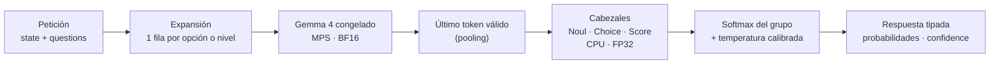

<div align="center">

# 🧠 Gemma System One

### Decisiones tipadas y probabilísticas con Gemma 4, en local y sin generar texto

<p>
  
  
  
  
  
  
  
</p>

**[Inicio rápido](#-inicio-rápido)** · **[API](#-api)** · **[Resultados](#-resultados)** · **[Comandos](#-cli-gso)** · **[Estructura](#-estructura)** · **[Explicación sencilla](docs/explicacion.md)**

</div>

---

Gemma System One es un **evaluador local**: le das un mensaje (o un estado JSON) y un conjunto de preguntas con sus criterios, y devuelve **probabilidades calculadas**, no texto generado. Se ejecuta en tu Mac con Apple Silicon: Gemma 4 congelado extrae representaciones y unos cabezales entrenados deciden.

<table>
<tr>
<td width="33%" valign="top">

### ✅ Noul
Pregunta de **sí o no**.

`noul: 0.987`

</td>
<td width="33%" valign="top">

### 🔘 Choice
**Una opción** entre 2 y 8, definidas en la propia pregunta.

`choice: "net"` · probabilidades por opción

</td>
<td width="33%" valign="top">

### 📊 Score
Nivel en una **rúbrica ordenada** de 2 a 5 niveles.

`score: 1.70` · distribución por nivel

</td>
</tr>
</table>

**Características:**
- **Opciones y rúbricas dinámicas:** viajan en cada petición y no se fijan en el modelo; renombrar los IDs o permutar las opciones no cambia las respuestas.
- **Hasta 8 preguntas por llamada**, con `confidence` como entropía normalizada.
- **Salida siempre válida:** sin `generate()` ni JSON que haya que analizar; `generated_tokens` es siempre 0.
- **Todo en local:** una API en `127.0.0.1`, sin servicios externos.

> [!IMPORTANT]
> El modelo se ha entrenado y evaluado **sólo con datos sintéticos** de incidencias de soporte (facturación, acceso, fallos técnicos, alcance e impacto), en español e inglés. No se ha evaluado con datos reales, así que no debe darse por supuesta su generalización a otros dominios. En las preguntas sobre el tipo de fallo, los datos de entrenamiento del modelo de servicio tenían algunas regularidades estructurales en las opciones; los controles muestran que el modelo lee el mensaje, pero esas cifras deben tomarse con cautela.

## ⚙️ Cómo funciona



- **Filas:** cada opción de Choice y cada nivel de Score se serializa como una fila con el estado, la pregunta y el criterio.
- **Representación:** el modelo la extrae de una fila por forward.
- **Decisión:** un evaluador compartido puntúa todas las filas de la pregunta y la normalización se hace sobre el grupo completo, así que las opciones pueden cambiar en cada petición.

## 🚀 Inicio rápido

<table>
<tr><td><b>Requisitos</b></td><td>
Mac con Apple Silicon (probado en M5 Pro, 48 GB) · Python 3.11 · <a href="https://docs.astral.sh/uv/">uv</a> · ~16 GB de disco para los pesos de E4B (~10 GB para E2B)
</td></tr>
<tr><td><b>Memoria MPS</b></td><td>
~17 GB con E4B (servicio recomendado) · ~11 GB con E2B
</td></tr>
</table>

```bash
# 1 · Instalar
git clone <url-del-repositorio> gemma_system_one && cd gemma_system_one
uv sync --frozen
uv run pytest tests/unit tests/integration -q          # comprobación en CPU, sin pesos

# 2 · Pesos de Gemma 4 E4B (descarga única, revisión fijada) y diagnóstico del Mac
uv run gso download --config configs/e4b_text.yaml
uv run gso doctor   --config configs/e4b_text.yaml

# 3 · Datos sintéticos deterministas
uv run gso generate-data --kind mixed --generator-version v3 --seed 0 --cases 1000 --out data/pilot_v3
uv run gso split --dataset data/pilot_v3 --seed 0
uv run gso generate-data --kind mixed --generator-version v3 --seed 6 --cases 300 --out data/pilot_v3_holdout6
uv run gso generate-data --kind mixed --generator-version v3 --seed 7 --cases 400 --out data/pilot_v3_seed7
uv run gso generate-data --kind mixed --generator-version v3 --seed 8 --cases 300 --out data/pilot_v3_seed8
uv run python scripts/derive_phase6b_data.py            # calibración (calib7) y test (final8) sin solapes

# 4 · Entrenar y calibrar (~12 min, casi todo extracción con E4B)
caffeinate -i uv run gso train --config configs/e4b_experiment.yaml          # → runs/e4b_experiment/<ts>
uv run gso calibrate --checkpoint runs/e4b_experiment/<ts>/checkpoint --split all --dataset data/pilot_v3_calib7

# 5 · Servir
cp configs/serve_e4b_text.yaml configs/serve_local.yaml  # ajusta checkpoint y calibration a tus rutas
uv run gso serve --config configs/serve_local.yaml       # → http://127.0.0.1:8000
```

> [!TIP]
> `curl -s http://127.0.0.1:8000/health/ready` devuelve 200 cuando el modelo está cargado, verificado y caliente. El arranque en frío tarda unos 9 s con E4B.

<details>
<summary><b>🪶 Variante ligera con E2B (~7 min de entrenamiento)</b></summary>

1. En el paso 2, usa `configs/e2b_text.yaml`.
2. En el paso 4, usa `configs/pilot_ce_v3.yaml` y calibra con `--split calibration` o con el conjunto externo.
3. Crea la configuración de servicio igual que en el paso 5.

Es más rápido (p50 de unos 550 ms) y menos preciso; ver [Resultados](#-resultados).

</details>

<details>
<summary><b>🧪 Evaluar el modelo entrenado</b></summary>

```bash
uv run gso evaluate --checkpoint runs/e4b_experiment/<ts>/checkpoint --split all \
  --dataset data/pilot_v3_final8 \
  --calibration runs/e4b_experiment/<ts>/calibration/calibration-<fecha>.json --baselines
uv run gso benchmark --config configs/serve_local.yaml --dataset data/pilot_v3 --split validation \
  --requests 100 --warmup 5 --out benchmark.json
```

</details>

## 🔌 API

`POST /v1/decide`:

| Campo | Contenido |
|---|---|
| `model` | El `model_id` de la configuración de servicio |
| `state` | Texto o JSON |
| `questions` | De 1 a 8, cada una con su identificador |
| `image` | Opcional: PNG o JPEG en base64, sólo para checkpoints entrenados con imagen |

```bash
curl -s -X POST http://127.0.0.1:8000/v1/decide -H 'Content-Type: application/json' -d '{
  "model": "gemma-system-one-e4b-heads-v0.1",
  "state": "Hola, desde esta mañana la VPN se desconecta cada pocos minutos y además me han cobrado dos veces la cuota de junio. Solicito la devolución del cargo duplicado.",
  "questions": {
    "refund":   {"type": "noul", "instructions": "¿El cliente pide una devolución?"},
    "fault":    {"type": "choice", "instructions": "¿Qué tipo de fallo técnico describe el mensaje?",
                 "criteria": {"net": "Red o conectividad (DNS, VPN, conexión)", "slow": "Lentitud o rendimiento",
                              "none": "No se describe ningún fallo técnico", "other": "Otro tipo de fallo técnico"}},
    "severity": {"type": "score", "instructions": "Evalúa la situación técnica descrita.",
                 "criteria": ["No se describe ningún fallo técnico", "Hubo un fallo técnico, pero ya está resuelto",
                              "Hay un fallo técnico activo"]}
  }
}'
```

<details open>
<summary><b>Respuesta real del modelo de servicio</b> (abreviada)</summary>

```json
{
  "model": "gemma-system-one-e4b-heads-v0.1",
  "checkpoint_id": "decision_heads:97fbb4d1b9cc7609+cal:f42131010813",
  "answers": {
    "refund":   { "type": "noul", "noul": 0.987 },
    "fault":    { "type": "choice", "choice": "net",
                  "probabilities": { "net": 0.954, "slow": 0.025, "other": 0.013, "none": 0.007 },
                  "confidence": 0.833 },
    "severity": { "type": "score", "score": 1.70, "probabilities": [0.152, 0.000, 0.848],
                  "legend": ["No se describe ningún fallo técnico",
                             "Hubo un fallo técnico, pero ya está resuelto",
                             "Hay un fallo técnico activo"],
                  "confidence": 0.611 }
  },
  "usage": { "questions": 3, "expanded_rows": 8, "backbone_forwards": 8,
             "processed_input_tokens": 1652, "image_tokens": 0, "padding_tokens": 0, "generated_tokens": 0 },
  "metadata": { "confidence_method": "normalized_entropy_v1", "request_id": "…",
                "timing_ms": { "forward_synchronized": 1016.2, "server_total": 1030.5 } }
}
```

</details>

<details>
<summary><b>Endpoints, errores y límites</b></summary>

| Endpoint | Uso |
|---|---|
| `GET /health/live` | El proceso responde |
| `GET /health/ready` | Modelo cargado, verificado y con warmup; incluye el dispositivo, las temperaturas y la identidad |
| `POST /v1/decide` | Decisión tipada |

| Código | Causa |
|---|---|
| `422` | Esquema inválido o modalidad incorrecta (p. ej., una imagen en un modelo sólo de texto) |
| `413` | Cuerpo o imagen demasiado grandes |
| `400` | Imagen ilegible |
| `404` | Ruta desconocida |
| `503` | Cola llena, tiempo agotado o modelo aún sin cargar |

- **Coste:** una petición cuesta un forward por fila: 1 por pregunta Noul, K por Choice y M por Score. En el ejemplo, 1 + 4 + 3 = 8.
- **Concurrencia:** un proceso con un worker y una cola acotada (`max_queue`).
- **Red:** escucha sólo en loopback.
- **Timeout:** no interrumpe un forward ya iniciado en la GPU.

</details>

## 📈 Resultados

Test final con **888 preguntas nuevas** (296 grupos), que no se usaron para ajustar pesos ni temperaturas. Datos sintéticos, medidos en un Mac M5 Pro.

| Modelo | NLL calibrada ↓ | Accuracy Noul · Choice · Score | Latencia HTTP p50 · p95 |
|---|:---:|:---:|:---:|
| Prior (baseline) | 1,032 | — | — |
| Bolsa de palabras (baseline) | 0,942 | — | — |
| E2B + cabezales | 0,384 | 0,93 · 0,81 · 0,79 | — |
| E2B + LoRA + cabezales | 0,347 | 0,94 · 0,86 · 0,76 | 551 · 909 ms |
| 🏆 **E4B + cabezales** (servicio) | **0,201** | **0,96 · 0,90 · 0,89** | 910 · 1546 ms |

- **E4B frente a E2B + LoRA:** mejora la NLL en −0,146 [−0,186; −0,104] (IC95 % por bootstrap de grupos), con ~1,6× de latencia. Latencias por petición de 3 preguntas (~8 filas); ~1 petición/s con un worker.
- **Lee el estado:** en controles donde sólo cambia el mensaje, con las opciones idénticas, el modelo cambia su respuesta. No decide por las opciones.
- **🖼️ Imagen:** hay un servicio con una imagen por petición (`configs/serve_vision.yaml`, E2B) sobre paneles de barras sintéticos. Supera claramente al mismo modelo sin imagen en estilos no vistos, pero no está calibrado.
- **🔁 Reproducible:** desde un clon limpio, los datos se regeneran idénticos y el entrenamiento de cabezales se reproduce bit a bit.

## 🧰 CLI `gso`

| Comando | Para qué |
|---|---|
| `gso download` | Pesos con revisión fijada y verificación sha256 |
| `gso doctor` | Compatibilidad, memoria y recarga con el modelo real |
| `gso generate-data` | Datasets sintéticos deterministas (`--kind mixed\|vision`) |
| `gso validate-data` | Esquema, ficheros y grupos |
| `gso split` | Train / validation / calibration / test por grupos, sin fugas |
| `gso train` | Cabezales sobre la base congelada, o LoRA + cabezales |
| `gso calibrate` | Temperatura por primitiva (partición interna o conjunto externo) |
| `gso evaluate` | Métricas y predicciones auditables (`--split test` exige `--final-test`) |
| `gso compare` | Diferencia emparejada entre dos modelos, con IC |
| `gso serve` | API local con el modelo real |
| `gso benchmark` | Arranque, latencia y saturación de la API |

> [!NOTE]
> **Tus propios datos:** JSONL con `state`, `question` (`type`, `instructions`, `criteria`), `target` y `group_id` (esquema v1 en [`docs/ESPECIFICACION.md`](docs/ESPECIFICACION.md) §5.1). Valídalos con `gso validate-data --dataset data/mis_datos` y evalúa con `gso evaluate --split all --dataset data/mis_datos`.

## 📁 Estructura

```text
gemma_system_one/
├── src/gemma_system_one/   # contratos, serialización, modelo, entrenamiento, calibración, API y CLI
├── configs/                # modelo, entrenamiento y servicio (YAML)
├── scripts/                # derivación de datasets y análisis reproducibles
├── tests/
│   ├── unit/ integration/  # CPU, sin pesos
│   ├── mps/                # hardware real (MPS + pesos)
│   └── e2e/                # servicio con checkpoints entrenados (se omiten si faltan)
├── docs/                   # explicación sencilla (explicacion.md), especificación y decisiones de diseño
└── reports/                # evidencia de cada experimento: métricas, protocolos y comandos
```

<div align="center">

**Licencia:** [Apache 2.0](LICENSE) · Atribución de Gemma 4 y condiciones de uso en [NOTICE](NOTICE). Los pesos de Gemma 4 no se incluyen: los publica Google bajo Apache 2.0 y deben usarse respetando su [política de usos prohibidos](https://ai.google.dev/gemma/prohibited_use_policy).

</div>
