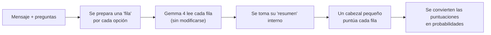

# Gemma System One, explicado de forma sencilla

Este documento cuenta, sin tecnicismos innecesarios, qué se ha construido, cómo se ha hecho, qué se ha conseguido y cómo se comparan los dos tamaños de modelo probados: **Gemma 4 E2B** (el pequeño) y **Gemma 4 E4B** (el grande). Las cifras salen de los informes de `reports/`. Al final hay un glosario.

## 1. Qué es

Es un programa que **responde preguntas de decisión** sobre un mensaje. Por ejemplo, ante una incidencia de soporte («la VPN se me desconecta y me han cobrado dos veces»), puede responder:

- **Sí/no (Noul):** «¿Pide una devolución?» → 0,99 de probabilidad de «sí».
- **Elegir una opción (Choice):** «¿Qué tipo de fallo es: red, lentitud, ninguno u otro?» → «red», con un 95 %.
- **Poner una nota en una escala (Score):** «¿El fallo está ausente, resuelto o activo?» → «activo», con un 85 %.

Tiene tres rasgos diferenciales:

1. **No escribe texto.** No es un chatbot. Devuelve probabilidades calculadas, siempre con el formato correcto, así que no hay respuestas inventadas ni JSON mal formado.
2. **Las opciones las pones tú en cada pregunta.** No están fijadas en el modelo: puedes preguntar con otras categorías, en otro orden o con otros nombres, y el modelo las entiende por su descripción.
3. **Funciona en local**, en un Mac con Apple Silicon, sin enviar datos a ningún servicio externo.

## 2. Cómo funciona por dentro (en una imagen)

1. **Filas:** por cada opción posible se construye un texto con el mensaje, la pregunta y esa opción.
2. **Lectura:** Gemma 4 lee cada texto y produce un «resumen» interno, una lista de números que representa lo que ha entendido.
3. **Puntuación:** un **cabezal**, que es un modelo diminuto entrenado por nosotros, convierte ese resumen en una puntuación.
4. **Probabilidades:** las puntuaciones de todas las opciones se reparten en probabilidades que suman 100 %.

Gemma 4 aporta la comprensión del lenguaje y el cabezal aprende a decidir. Por eso el entrenamiento es barato: casi siempre sólo se ajusta el cabezal, y Gemma queda intacto.

## 3. Cómo se ha hecho (el proceso, paso a paso)

El trabajo se dividió en fases. Cada una tenía un criterio para darla por terminada y ninguna se cerró sin cumplirlo.

| Fase | Qué se hizo, en simple | Qué se comprobó |
|---|---|---|
| **0. Base** | Instalar todo, descargar Gemma 4 con una versión fija y crear un «chequeo médico» del Mac (`gso doctor`) | Que Gemma 4 funciona de verdad en la GPU del Mac: lee, aprende y se guarda y recupera bien |
| **1. Primer cabezal** | Datos de práctica, reparto en conjuntos separados y un cabezal de sí/no | Que el sistema es capaz de aprender (puede memorizar un conjunto pequeño) |
| **2. Las tres preguntas** | Cabezales de «elegir opción» y «poner nota», con opciones que cambian en cada pregunta | Que el orden y los nombres de las opciones no alteran la respuesta |
| **3. Afinar Gemma (LoRA)** | Ajustar una pequeña parte de Gemma 4, calibrar las probabilidades y hacer un examen final a ciegas | Que afinar mejora al cabezal solo, y que el modelo guardado da exactamente lo mismo al recargarlo |
| **4. Imágenes** | Una imagen por pregunta (gráficos de barras) | Que el modelo mira de verdad la imagen: sin ella, o con la de otro caso, acierta mucho menos |
| **5. Servicio** | Una API local con cola y límites, y medición de velocidad | Que responde por HTTP con el modelo real, que falla con mensajes claros y cuánto tarda |
| **6. Modelo grande y verificación** | Probar E4B, probar más opciones y medir optimizaciones | Si el modelo grande compensa su coste |

**Reglas de trabajo que dan fiabilidad a los resultados:**
- **Datos separados:** con unos se entrena, con otros se eligen ajustes, con otros se calibra y con otros se hace el examen final. El examen nunca se usa para elegir nada.
- **Reglas escritas antes:** en las pruebas importantes, el criterio de éxito se fijó por escrito (con huella digital) antes de ver los resultados, para no ajustar la conclusión a posteriori.
- **Revisión independiente** de cada fase. Varias veces encontró problemas, se corrigieron y se volvió a medir; el apartado 6 cuenta lo aprendido.
- **Todo reproducible:** cada resultado guarda el código exacto que lo produjo, y desde una copia limpia del repositorio se regeneran los mismos datos y el mismo modelo, bit a bit.

## 4. Qué se ha conseguido

- ✅ **Un sistema completo de principio a fin:** genera datos, entrena, calibra, guarda, recarga y responde por HTTP con el modelo real.
- ✅ **Mucho mejor que las referencias sencillas.** En el examen final, el mejor modelo comete unas **5 veces menos error** que un clasificador simple de palabras (NLL 0,20 frente a 0,94).
- ✅ **El modelo lee el mensaje, no hace trampas con las opciones.** Con la misma pregunta y las mismas opciones, pero mensajes distintos, cambia su respuesta correctamente. El techo de acierto sin leer el mensaje es de 1/3, y el modelo grande llega al 85–92 %.
- ✅ **Opciones flexibles:** renombrar o reordenar las opciones no cambia las respuestas.
- ✅ **Imágenes:** con gráficos de estilos nunca vistos, la versión con imagen reduce el error a un tercio frente a la misma sin imagen.
- ✅ **Reproducible:** una copia limpia desde GitHub reproduce los datos y el entrenamiento exactamente.
- ✅ **Se descartó con datos lo que no funcionaba:**
  - procesar varias opciones a la vez no aceleraba nada y cambiaba algunas respuestas;
  - afinar el modelo grande con LoRA sólo cabe en memoria con una técnica de ahorro, que se dejó preparada.

## 5. E2B frente a E4B: resultados

**Examen final:** 888 preguntas nuevas, nunca usadas para ajustar nada.

| | E2B + cabezal | E2B + LoRA + cabezal | **E4B + cabezal** |
|---|---|---|---|
| Tamaño del modelo base | ~5 mil millones de parámetros | ~5 mil millones | ~8 mil millones |
| Qué se entrena | Sólo el cabezal | El cabezal + una pequeña parte de Gemma | Sólo el cabezal |
| **Error (NLL, menor es mejor)** | 0,384 | 0,347 | **0,201** |
| Acierto sí/no (Noul) | 93 % | 94 % | **96 %** |
| Acierto elegir opción (Choice) | 81 % | 86 % | **90 %** |
| Acierto poner nota (Score) | 79 % | 76 % | **89 %** |
| Tiempo por consulta (típico / lento) | — | **0,55 s / 0,91 s** | 0,91 s / 1,55 s |
| Consultas por segundo | — | **1,8** | 1,1 |
| Arranque del servicio | — | **~6 s** | ~9,5 s |
| Memoria de GPU | **~11 GB** | ~11 GB | ~17 GB |
| Tiempo de entrenamiento | **~7 min** | ~75 min | ~12 min |

Referencias sencillas en el mismo examen: adivinar por frecuencia, NLL 1,03; clasificador de palabras, NLL 0,94.

**Cómo leerlo:**
- **E4B es claramente el más preciso.** Frente a E2B + LoRA, su error baja 0,146 (con un 95 % de confianza, entre 0,104 y 0,186). Acierta más en las tres primitivas, sobre todo al poner nota.
- **E2B es más rápido y ligero:** responde ~1,6 veces antes, arranca antes y necesita menos memoria.
- **Afinar E2B con LoRA ayuda, pero poco:** reduce el error de 0,384 a 0,347 y cuesta unos 75 minutos de entrenamiento. Pasar a E4B con sólo el cabezal da mucho más y se entrena en ~12 minutos.
- **Decisión:** el servicio recomendado es **E4B + cabezal** (`configs/serve_e4b_text.yaml`). Si la velocidad o la memoria importan más que la precisión, E2B + LoRA (`configs/serve_text.yaml`) es la alternativa.

**Otras diferencias observadas:**
- **Fallos que no están en la lista:** son el punto débil de los dos.
  - E2B tiende a confundir «hay un fallo que no está en la lista» con «no hay fallo».
  - E4B, con las definiciones antiguas, metía los fallos de lentitud o de datos en «aplicación». Al redactar las categorías sin solapes, ese error casi desapareció. Su error restante está en los fallos «ya resueltos», que a veces lee como «sin fallo».
- **Más opciones (hasta 8):** E2B mantuvo su acierto con 8 opciones; en E4B no se pudo demostrar con el margen fijado, aunque la pérdida medida fue pequeña (unos 2–3 puntos).
- **Imágenes:** sólo se probaron con E2B.

## 6. Lo que se aprendió por el camino

Las revisiones encontraron varios problemas, y corregirlos hizo los resultados más fiables:

- **Pistas en las opciones:** en los datos de práctica, el número de opciones o su combinación daba a veces pistas sobre la respuesta. Se crearon nuevas versiones del generador (v4 y v5) que las eliminan, y pruebas específicas que confirman que el modelo lee el mensaje.
- **Categorías que se solapaban:** «error de la aplicación» abarcaba sin querer la lentitud y la pérdida de datos. La versión v5 las define sin solapes.
- **Calibración con pocos datos:** ajustar las probabilidades con sólo 300 preguntas las empeoraba en E4B. Con un conjunto de 1200 dejó de ocurrir.
- **Elegir y medir con los mismos datos:** cuando un conjunto sirvió para elegir el modelo, se generó otro nuevo para medirlo de forma independiente.
- **Un fichero de configuración de Git** dejaba fuera del repositorio parte del código. Se corrigió y se comprobó con una copia limpia.

## 7. Límites (lo que no se puede afirmar)

- **Todos los datos son sintéticos:** incidencias de soporte generadas por reglas, en español e inglés. **No se ha probado con mensajes reales**, porque no hay datos reales etiquetados. No se sabe cómo funcionaría en otro negocio.
- **La confianza (`confidence`)** indica lo concentrada que está la respuesta, no que sea correcta.
- **El servicio atiende de una en una:** un proceso con una cola corta, y una consulta ya empezada no se puede cortar a medias.
- **El modelo de imágenes** sólo conoce gráficos de barras sintéticos y no está calibrado.

## Glosario

| Término | Significado |
|---|---|
| **Gemma 4 E2B / E4B** | Modelos de lenguaje de Google, en versión pequeña y grande. Aquí se usan como «lectores» que no se modifican |
| **Cabezal** | Modelo diminuto que convierte la lectura de Gemma en una puntuación; es lo que se entrena |
| **LoRA** | Técnica para afinar una parte pequeña de Gemma sin tocar el resto |
| **NLL** | Medida de error de las probabilidades: castiga estar muy seguro y fallar. Menor es mejor; 0 sería perfecto |
| **Accuracy (acierto)** | Porcentaje de respuestas correctas, tomando la opción más probable |
| **Calibración** | Ajuste para que un «80 %» signifique de verdad acertar unas 8 de cada 10 veces |
| **Examen final (test)** | Datos reservados que sólo se usan una vez, al final, para medir |
| **Intervalo de confianza** | Rango donde probablemente está el valor real; si no incluye el 0, la diferencia es fiable |
| **MPS** | La forma de usar la GPU de los Mac con Apple Silicon |
